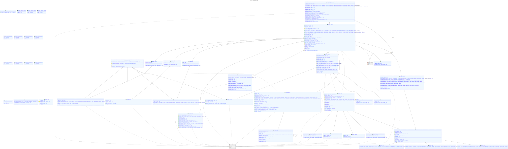
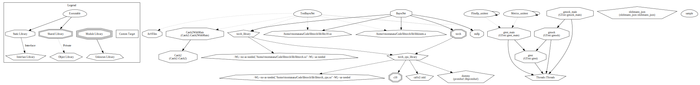

#   BayesNet


[](<https://opensource.org/licenses/MIT>)

[](https://app.codacy.com/gh/Doctorado-ML/BayesNet/dashboard?utm_source=gh&utm_medium=referral&utm_content=&utm_campaign=Badge_grade)
[](https://sonarcloud.io/summary/new_code?id=rmontanana_BayesNet)
[](https://sonarcloud.io/summary/new_code?id=rmontanana_BayesNet)

[](html/index.html)

Bayesian Network Classifiers using libtorch from scratch

## Dependencies

The only external dependency is [libtorch](https://pytorch.org/cppdocs/installing.html) which can be installed with the following commands:

```bash
wget https://download.pytorch.org/libtorch/nightly/cpu/libtorch-shared-with-deps-latest.zip
unzip libtorch-shared-with-deps-latest.zips
```

## Setup

### Release

```bash
make release
make buildr
sudo make install
```

### Debug & Tests

```bash
make debug
make test
make coverage
```

### Sample app

After building and installing the release version, you can run the sample app with the following commands:

```bash
make sample
make sample fname=tests/data/glass.arff
```

## Models

### [BoostAODE](docs/BoostAODE.md)

## Diagrams

### UML Class Diagram



### Dependency Diagram


